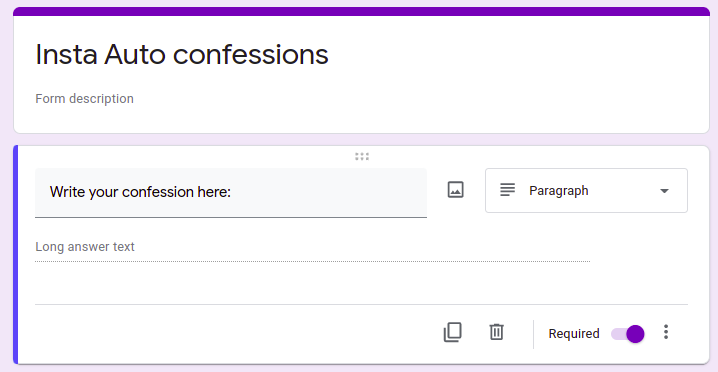
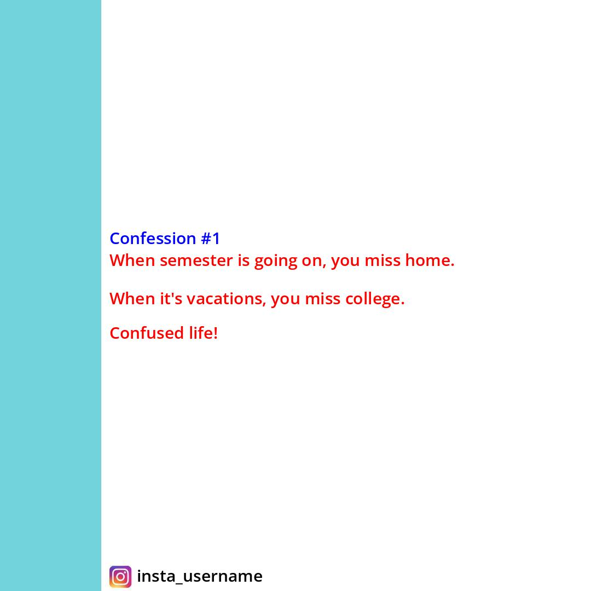
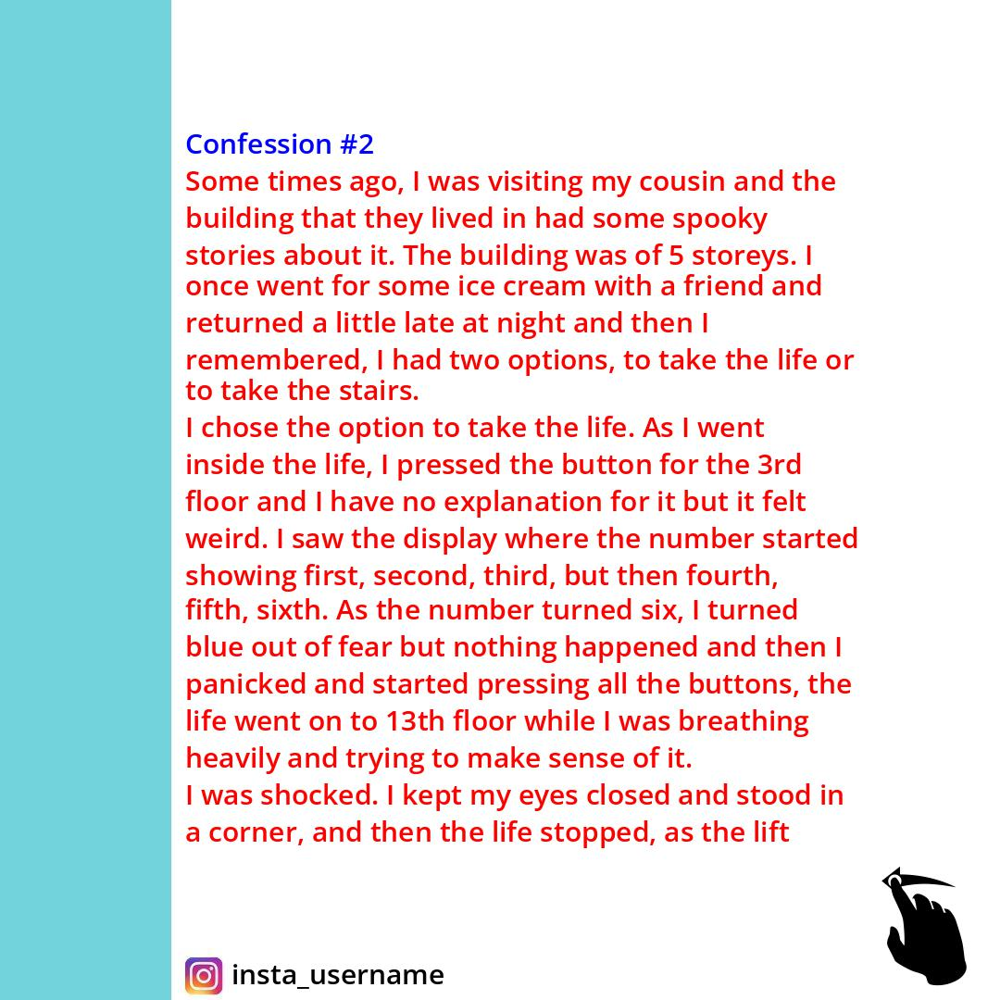
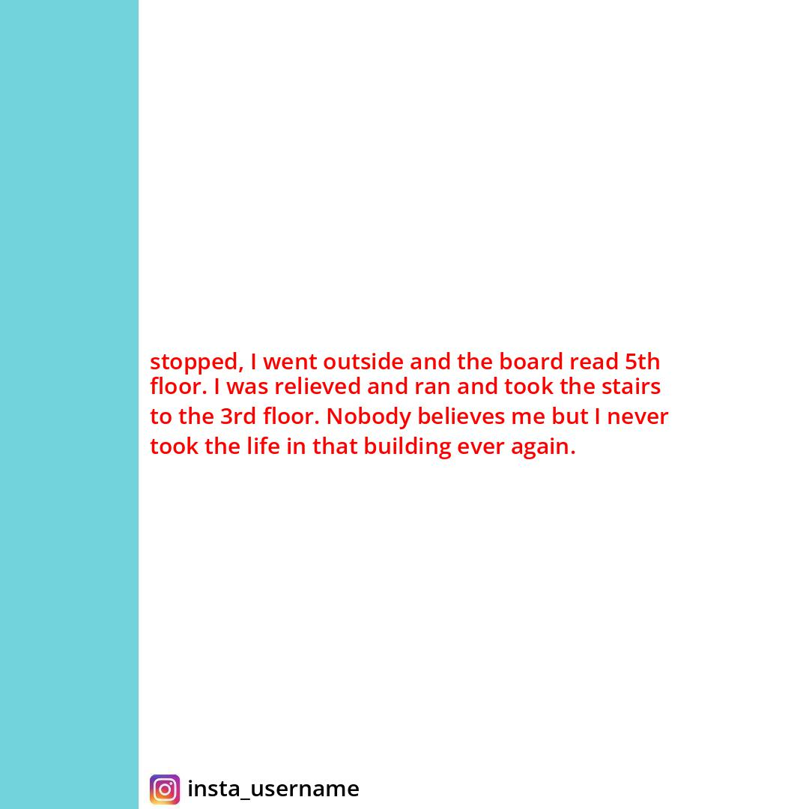

# Auto-Instagram-Confessions
This a simple backend service which can be used to post confessions or entries among a group. You need to create a confessions account on Instagram and it will post confessions received from google forms anonymously and automatically.

## Standard Default approach for Instagram confession page
1. Receive anonymous confessions via a google form.
2. copy and paste them to a photo editing software and make an Instagrammable post photo.
3. save that photo and post it to your Instagram account with proper counting.

> This is a very lengthy approach. The Admin has to do a lot of work for posting each confession.

## An improvised Solution:
Here I purpose a program that reads the confessions from a google sheet (responses of google forms) and writes them to a specific photo template and posts these photos to Instagram with proper automatic counting. If the length of the confession is larger than a single template, it creates multiple templates for that confessions and posts an album post with all photos.

## Implementation:
I used the following python libraries for the implementation:
1. `pandas` python library to read confessions from google sheet.
2. `PIL` python library to modify the template by writing the confession text.
3. `instagrapi` python library to post the confessions on Instagram.

## Deployment:
You can deploy it locally:
1. Create a google form like this:

2. clone this repository using `https://github.com/manoj2601/Auto-Instagram-Confessions.git` or download it in zip format and extract it.
3. edit config.py with your login credentials and google sheet link (where the google form responses are being stored).
4. Run `python main.py` whenever you want to post confessions on your Instagram handle.
  
  Now if you check your Instagram handle, all newly confessions are posted like the following: 

## Final Instagram posts:
**Single Post short confessions:**  

  
**Album post for long confessions:**  

        

## Contributing:
All contributions and suggestions are welcome!
* Raise an issue for suggestions.
* To contribute :
	1. Fork it.
	2. Create your feature branch: `git checkout -b my-new-feature`.
	3. Commit your changes: `git commit -am "Add  some feature"`
	4. Submit a pull request.

Give it a star, if you like the concept.
